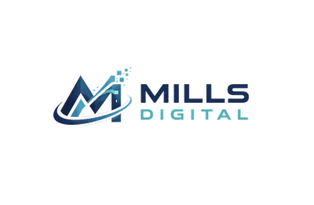

# Mills Digital Logo - Web Asset Package

## 📦 Package Contents

### Full-Size Logos
- `md_logo_transparent.png` - Original size (1290x843) with transparent background
- `md_logo_full.png` - Optimized full-size version
- `md_logo_large.png` - Large (800x523) - for hero sections
- `md_logo_medium.png` - Medium (400x261) - for headers/navigation
- `md_logo_small.png` - Small (200x131) - for mobile headers
- `md_logo_thumbnail.png` - Thumbnail (100x65) - for footers/small displays

### Favicons
- `favicon.ico` - Multi-size ICO file (16x16, 32x32, 48x48)
- `favicon_16x16.png` - Browser tab icon
- `favicon_32x32.png` - Browser tab icon (retina)
- `favicon_64x64.png` - Windows taskbar
- `favicon_128x128.png` - Chrome Web Store
- `favicon_256x256.png` - Large displays

## 🚀 Usage Examples

### HTML - Basic Logo in Header
```html
<header>
  
</header>
```

### HTML - Responsive Logo
```html
<picture>
  <source media="(max-width: 480px)" srcset="md_logo_small.png">
  <source media="(max-width: 768px)" srcset="md_logo_medium.png">
  
</picture>
```

### HTML - Favicon Setup
```html
<head>
  <!-- Standard favicon -->
  <link rel="icon" type="image/x-icon" href="favicon.ico">
  
  <!-- PNG favicons for different sizes -->
  <link rel="icon" type="image/png" sizes="16x16" href="favicon_16x16.png">
  <link rel="icon" type="image/png" sizes="32x32" href="favicon_32x32.png">
  <link rel="icon" type="image/png" sizes="64x64" href="favicon_64x64.png">
  
  <!-- Apple Touch Icon -->
  <link rel="apple-touch-icon" sizes="180x180" href="favicon_256x256.png">
  
  <!-- Android Chrome -->
  <link rel="icon" type="image/png" sizes="192x192" href="favicon_256x256.png">
</head>
```

### CSS - Background Logo
```css
.hero {
  background-image: url('md_logo_large.png');
  background-repeat: no-repeat;
  background-position: center;
  background-size: contain;
}

.header-logo {
  display: block;
  width: 200px;
  height: auto;
}
```

### React/Next.js
```jsx
import Image from 'next/image'

export default function Logo() {
  return (
    <Image
      src="/md_logo_medium.png"
      alt="Mills Digital"
      width={400}
      height={261}
      priority
    />
  )
}
```

### WordPress
```php
/images/md_logo_medium.png" 
  alt="Mills Digital"
  class="custom-logo"
/>
```

## 📱 Recommended Usage by Device/Context

| Context | Recommended File | Size |
|---------|-----------------|------|
| Desktop Header | `md_logo_medium.png` | 400x261 |
| Mobile Header | `md_logo_small.png` | 200x131 |
| Hero Section | `md_logo_large.png` | 800x523 |
| Footer | `md_logo_thumbnail.png` | 100x65 |
| Email Signature | `md_logo_small.png` | 200x131 |
| Social Media | `md_logo_medium.png` | 400x261 |
| Print | `md_logo_full.png` | 1290x843 |

## 🎨 Brand Colors (Extracted from Logo)

- Navy Blue: `#2C3E50` (main "M")
- Light Blue/Teal: `#4A90A4` (accent)
- Cyan: `#5DADE2` (highlights)

## ⚡ Performance Tips

1. **Always specify width/height** to prevent layout shift
2. **Use appropriate size** - don't load large images for small displays
3. **Consider lazy loading** for below-the-fold logos
4. **Optimize further** with tools like TinyPNG if needed
5. **Consider WebP format** for modern browsers (can save 25-35% file size)

## 🔄 Converting to SVG

For a true vector version that scales infinitely:

### Option 1: Online Tools
- Visit vectorizer.io or vectormagic.com
- Upload `md_logo_transparent.png`
- Adjust settings for best quality
- Download SVG

### Option 2: Adobe Illustrator
- File → Open → md_logo_transparent.png
- Object → Image Trace → Make
- Object → Expand
- File → Save As → SVG

### Option 3: Inkscape (Free)
- File → Import → md_logo_transparent.png
- Path → Trace Bitmap
- Adjust settings
- File → Save As → SVG

## 📋 File Sizes

- Full transparent: ~100 KB
- Large: ~75 KB
- Medium: ~35 KB
- Small: ~15 KB
- Thumbnail: ~5 KB
- Favicons: ~2-10 KB each

**Total Package: 332.6 KB**

## 🌐 Browser Support

All files are compatible with:
- ✅ Chrome (all versions)
- ✅ Firefox (all versions)
- ✅ Safari (all versions)
- ✅ Edge (all versions)
- ✅ IE 11+ (for PNG support)

## 📝 Notes

- All PNG files have transparent backgrounds
- Colors optimized for web display
- Maintains aspect ratio across all sizes
- Optimized for fast loading
- Ready for deployment

## 🔧 Need Custom Sizes?

If you need different dimensions, you can resize using:
- Online: tinypng.com, squoosh.app
- Desktop: GIMP, Photoshop, Preview (Mac)
- Command line: ImageMagick

Example with ImageMagick:
```bash
convert md_logo_transparent.png -resize 300x md_logo_custom.png
```

---

**Created:** February 2026  
**For:** Mills Digital  
**Package Version:** 1.0
